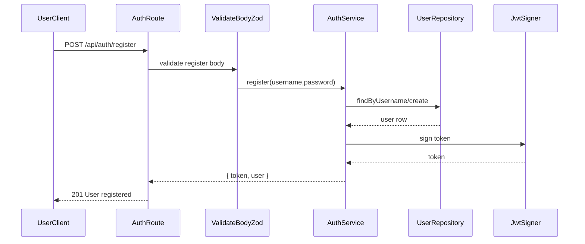
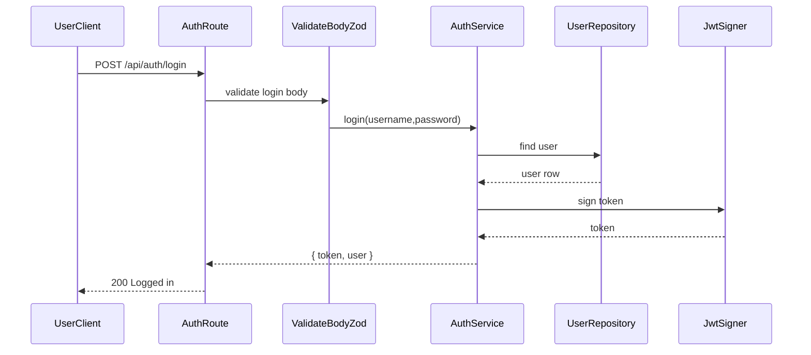

# API specification — authentication

Global response shapes: [Response format](response-format.md).

This document describes the HTTP API implemented for **step 2** (auth only). All paths are relative to the server base URL (for example `http://localhost:3000` in local development).

## Conventions

| Item | Value |
|------|--------|
| API prefix | `/api` |
| Request body | JSON (`Content-Type: application/json`) |
| Response body | JSON |
| Character set | UTF-8 |

Unless noted, request bodies must be valid JSON objects.

---

## User flow

### `POST /api/auth/register`



### `POST /api/auth/login`



---

## Success envelope

Successful **register** and **login** responses use the standard success envelope:

| Field | Type | Description |
|-------|------|-------------|
| `message` | `string` | Summary (e.g. `User registered`, `Logged in`). |
| `data` | `object` | Auth payload (see below). |

### `data` object

| Field | Type | Description |
|-------|------|-------------|
| `token` | `string` | JWT for `Authorization: Bearer <token>` on protected routes (for example node writes in [nodes.md](nodes.md)). |
| `user` | `object` | Public user profile (no password fields). |
| `user.id` | `string` (UUID) | User identifier. |
| `user.username` | `string` | Username. |
| `user.avatar_url` | `string \| null` | Avatar URL if set; otherwise `null`. |

The `password_hash` is never returned.

---

## `POST /api/auth/register`

Creates a new user and returns a session token.

### Request body

| Field | Type | Constraints |
|-------|------|-------------|
| `username` | `string` | Trimmed, length 1–50 (matches DB `VARCHAR(50)`). |
| `password` | `string` | Minimum length 8. |

### Responses

| Status | Condition | Body |
|--------|-----------|------|
| `201` | User created | `{ "message": "User registered", "data": { "token", "user" } }` |
| `400` | Validation failed (Zod) | `{ "message": "Validation failed", "errors": <Zod flatten object> }` |
| `409` | Username already exists | `{ "message": "Username already taken" }` |
| `500` | Unexpected server error | `{ "message": "Internal server error" }` |

### Example

**Request**

```http
POST /api/auth/register HTTP/1.1
Content-Type: application/json

{"username":"alice","password":"hunter2000"}
```

**Response** `201`

```json
{
  "message": "User registered",
  "data": {
    "token": "<jwt>",
    "user": {
      "id": "b1c2d3e4-5678-90ab-cdef-1234567890ab",
      "username": "alice",
      "avatar_url": null
    }
  }
}
```

---

## `POST /api/auth/login`

Authenticates an existing user.

### Request body

Same fields and validation rules as **register**:

| Field | Type | Constraints |
|-------|------|-------------|
| `username` | `string` | Trimmed, length 1–50. |
| `password` | `string` | Minimum length 8. |

### Responses

| Status | Condition | Body |
|--------|-----------|------|
| `200` | Credentials valid | `{ "message": "Logged in", "data": { "token", "user" } }` |
| `400` | Validation failed (Zod) | Same shape as register `400`. |
| `401` | Unknown user or wrong password | `{ "message": "Invalid username or password" }` (same message in both cases). |
| `500` | Unexpected server error | `{ "message": "Internal server error" }` |

### Example

**Request**

```http
POST /api/auth/login HTTP/1.1
Content-Type: application/json

{"username":"alice","password":"hunter2000"}
```

**Response** `200`

```json
{
  "message": "Logged in",
  "data": {
    "token": "<jwt>",
    "user": {
      "id": "b1c2d3e4-5678-90ab-cdef-1234567890ab",
      "username": "alice",
      "avatar_url": null
    }
  }
}
```

---

## JWT (for upcoming protected routes)

- **Header:** `Authorization: Bearer <token>`
- **Claims:** Subject (`sub`) is the user UUID; payload includes `username` for convenience.
- **Signing / expiry:** Configured server-side via `JWT_SECRET` and `JWT_EXPIRES_IN` (see project env docs).

No authenticated **auth** endpoint is exposed in this scope. The same JWT is used for protected **node** writes (`POST /api/nodes`, `POST /api/nodes/:id/reply`); see [nodes.md](nodes.md).

---

## Error reference (`AppError` responses)

Optional `code` may appear when the server sets `AppError` with a `code` field. Current auth flows only set `message`.

| HTTP status | Typical `message` |
|-------------|-------------------|
| `400` | Validation failed (with `errors` for Zod) |
| `401` | Invalid username or password |
| `409` | Username already taken |
| `500` | Internal server error |

---

## Out of scope (not implemented yet)

Per project roadmap, these are **not** part of this document until implemented:

- Refresh tokens, logout, password reset
- `GET /api/auth/me` or other JWT-protected auth routes

Node routes are specified in [nodes.md](nodes.md).
