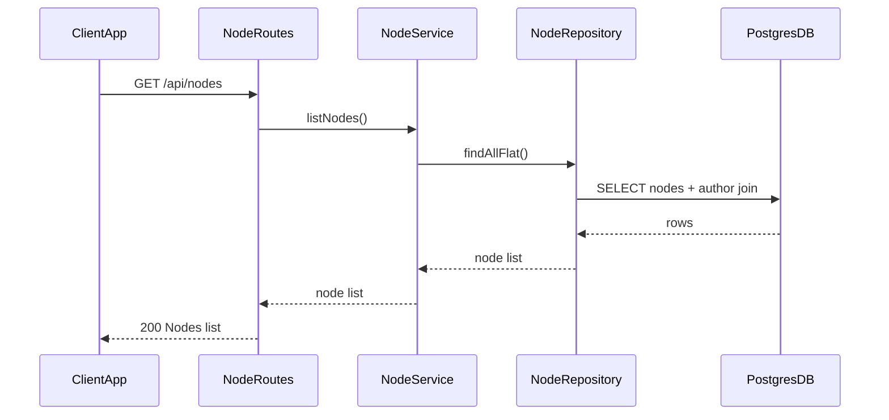
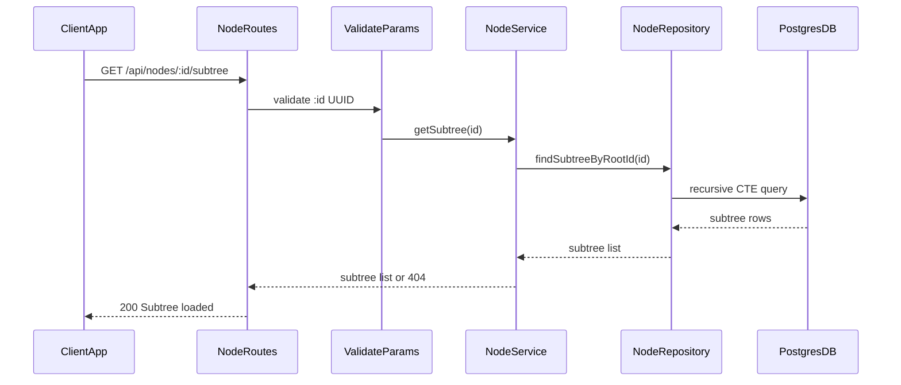
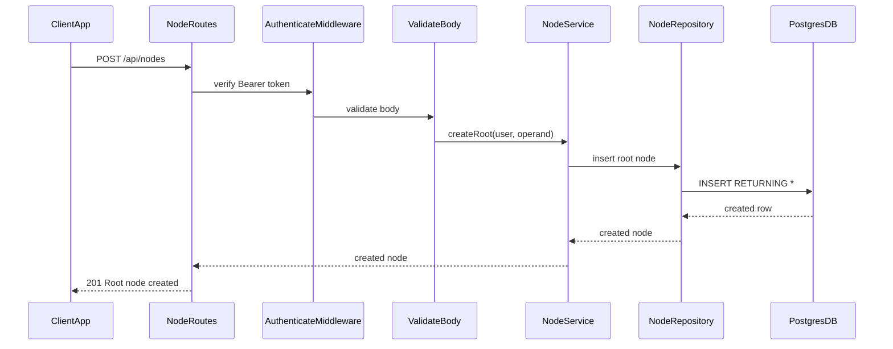
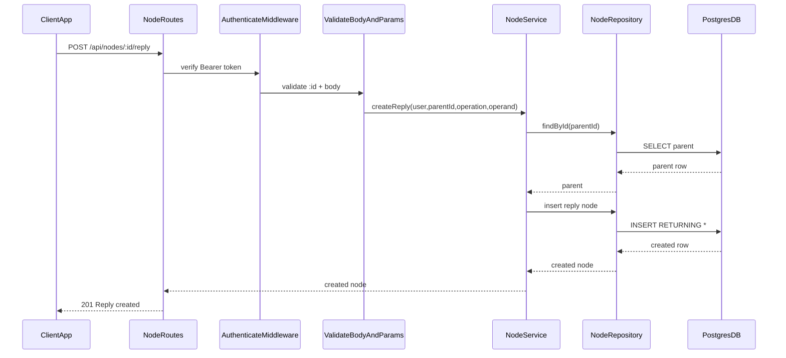

# API specification — nodes

Global response shapes: [Response format](response-format.md). Authentication: [Authentication](auth.md).

This document describes the HTTP API for **step 3** (nodes). All paths are relative to the server base URL (for example `http://localhost:3000` in local development).

## Conventions

| Item | Value |
|------|--------|
| API prefix | `/api` |
| Request body | JSON (`Content-Type: application/json`) where a body is required |
| Response body | JSON |

---

## User flow

### `GET /api/nodes`

### `GET /api/nodes/:id/subtree`

### `POST /api/nodes`

### `POST /api/nodes/:id/reply`

---

## Node payload shape

Each node in responses includes an **`author`** object (joined from `users` on reads; synthesized from the JWT on creates).

| Field | Type | Description |
|-------|------|-------------|
| `id` | `string` (UUID) | Node id |
| `author_id` | `string` (UUID) | Same as `author.id` |
| `parent_id` | `string` (UUID) \| `null` | `null` for root nodes |
| `operation` | `"none"` \| `"add"` \| `"sub"` \| `"mul"` \| `"div"` | Root nodes use `"none"` |
| `operand` | `number` | User-supplied operand |
| `result` | `number` | Stored result at write time (`operand` for roots; `parent.result OP operand` for replies) |
| `created_at` | `string` (ISO 8601) | Creation time |
| `updated_at` | `string` (ISO 8601) | Last update time |
| `author` | `object` | `{ id, username, avatar_url }` — no password fields |

Ordering: list and subtree arrays are sorted by `created_at` ascending.

---

## `GET /api/nodes`

Returns a **flat** array of all nodes. The client builds the tree from `parent_id`.

### Authentication

None.

### Responses

| Status | Condition | Body |
|--------|-----------|------|
| `200` | Success | `{ "message": "...", "data": [ <node>, ... ] }` |
| `500` | Unexpected server error | `{ "message": "Internal server error" }` |

---

## `GET /api/nodes/:id/subtree`

Returns the node with id `:id` and **all descendants** (recursive subtree), as a flat array ordered by `created_at` ascending.

### Authentication

None.

### Path parameters

| Param | Type | Constraints |
|-------|------|---------------|
| `id` | `string` | Must be a valid UUID |

### Responses

| Status | Condition | Body |
|--------|-----------|------|
| `200` | Root exists | `{ "message": "...", "data": [ <node>, ... ] }` (at least one element) |
| `400` | Invalid UUID | `{ "message": "Validation failed", "errors": <Zod flatten> }` |
| `404` | No node with that id | `{ "message": "Node not found" }` |
| `500` | Unexpected server error | `{ "message": "Internal server error" }` |

---

## `POST /api/nodes`

Creates a **root** node: `operation` is `none`, `operand` equals `result`, `parent_id` is `null`.

### Authentication

Required: `Authorization: Bearer <token>` (see [auth.md](auth.md)).

### Request body

| Field | Type | Constraints |
|-------|------|-------------|
| `operand` | `number` | Must be finite (not `NaN`, not `±Infinity`) |

### Responses

| Status | Condition | Body |
|--------|-----------|------|
| `201` | Created | `{ "message": "...", "data": <node> }` |
| `400` | Validation failed | `{ "message": "Validation failed", "errors": <Zod flatten> }` |
| `401` | Missing or invalid JWT | `{ "message": "Unauthorized" }` |
| `500` | Unexpected server error | `{ "message": "Internal server error" }` |

---

## `POST /api/nodes/:id/reply`

Creates a **child** node under the parent `:id`. The stored `result` is `parent.result` combined with `operand` using `operation`. **`none` is not allowed** for replies.

### Authentication

Required: `Authorization: Bearer <token>`.

### Path parameters

| Param | Type | Constraints |
|-------|------|---------------|
| `id` | `string` | Parent node id (UUID) |

### Request body

| Field | Type | Constraints |
|-------|------|-------------|
| `operation` | `string` | One of `add`, `sub`, `mul`, `div` |
| `operand` | `number` | Must be finite |

### Responses

| Status | Condition | Body |
|--------|-----------|------|
| `201` | Created | `{ "message": "...", "data": <node> }` |
| `400` | Validation failed (Zod) or **division by zero** (`operation` `div` and `operand` `0`) or non-finite computed result | `{ "message": "<reason>" }` (validation responses may include `errors`) |
| `401` | Missing or invalid JWT | `{ "message": "Unauthorized" }` |
| `404` | Parent id does not exist | `{ "message": "Parent node not found" }` |
| `500` | Unexpected server error | `{ "message": "Internal server error" }` |

---

## Out of scope (not implemented)

- `PATCH` / `DELETE` on nodes
- Authenticated reads for node endpoints
